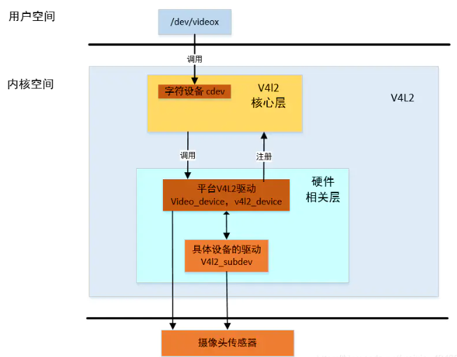
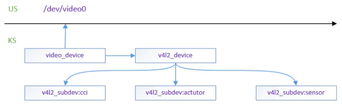

## 一、V4L2架构

#### 关键结构体：

- **v4l2_device：**用来描述一个*v4l2*设备实例，可以包含多个子设备，对应的是例如 *I2C、CSI、MIPI* 等设备，它们是从属于一个 *V4L2 device* 之下的。
- **v4l2_subdev：**用来初始化和控制子设备的方法
- **video_device：**创建设备节点*/dev/videoX*，用户空间和内核空间沟通的桥梁
- **videobuf2：**视频缓冲的处理
- **v4l2_fh：**文件访问控制
- **v4l2_ctrl_handler：**控制模块，提供子设备（主要是 *video* 和 *ISP* 设备）在用户空间的特效操作接口
- **media_device：**用于运行时数据流的管理，嵌入在 *V4L2* *device* 内部

*video_device、v4l2_device*和*v4l2_subdev*的关系

## 二、Camera挂载总线

Linux的设备和驱动通常都要挂在一种总线上，如I2C总线，USB总线等，但在Soc系统中集成的独立外设控制器是不依附于此类总线的，为了统一性，Linux发明了一种虚拟总线——*platform*总线，相应的设备就是*platform_device*,驱动就是*platform_driver*。

*Camera*也属于一颗集成的Soc，它有很多子设备：sensor感光芯片，eeprom，flash等，通过MIPI传输图像数据，通过I2C控制sensor的行为。因此，Camera 设备属于platform_device,挂在platform总线上。

因此流程上会写一个*platform_device*，一个*platform_driver*，然后调用platform_driver_register去初始化。

## 三、使用流程

注册设备后，platform总线会调用match函数去匹配驱动和设备，一旦匹配成功，就会调用probe函数。 一般`"compatible = "qcom,msm-cam"`节点匹配设备和驱动。匹配成功了，就会调用msm_probe函数去做实现一些功能。

### 3.1 msm_probe实现功能

platform只是虚拟的，我们还是要回归现实。现实中，camera是用来拍照，录视频的，所以应该把camera定义为一个**v4l2_device实例**， 子设备比如sensor，eeprom定义为**v4l2_subdev**，归*v4l2_device*统一管理；

但一个 V4L2 *device* 下属可能有非常多同类型的子设备（两个或者多个 sensor、ISP 等）那么在设备运行的时候怎么知道数据流需要用到哪一个类型的哪一个子设备呢。这个时候需要通过 **media_device**了，它为子设备建立一条虚拟的连线，建立起来一个运行时的 *pipeline*（管道），并且可以在运行时动态改变、管理接入的设备。

另外，如果内核空间要和用户空间沟通，我们还应该初始化 **video_device**

**msm_probe**函数应该完成**v4l2_device，media_device,video_device**等相关结构体的初始化工作