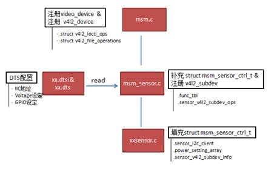
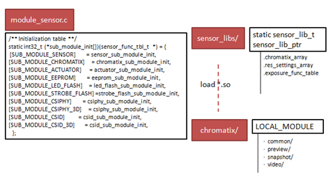
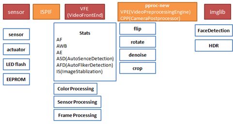

# 代码组织

高通平台对于camera的代码组织，大体上还是遵循Android的框架：即上层应用和HAL层交互，高通平台在HAL层里面实现自己的一套管理策略；在kernel中实现sensor的底层驱动。对于最核心的sensor端的底层设置、ISP效果相关等代码则是单独进行了抽离，放在了一个daemon进程中进行管理。

kernel层主要代码

camera在kernel层的主文件为msm.c，负责设备的具体注册及相关方法的填充；

在msm_sensor.c文件中，主要维护高通自己的一个sensor相关结构体—msm_sensor_ctrl_t，同时把dts文件中的配置信息读取出来；kernel层对于不同的sensor对应自己的一个驱动文件— xxsensor.c，主要是把power setting的设定填充到msm_sensor_ctrl_t中。  

在vendor目录下，高通把各个sensor实质性的代码放置在此。一部分代码是高通自己实现的daemon进程和kernel层及HAL层进行通讯的框架代码；另一部分则是和sensor相关的chromatix效果代码和sensor lib部分代码(init setting、lens info、output info)。

vendor层主要代码

如上图，高通平台通过一个函数指针数组sub_module_init来管理sensor相关的组件；其中重要的是sensor_sub_module_init和chromatix_sub_module_init模块，对于sensor模块需要对应填充sensor_lib_t下的接口，对于chromatix模块则是通过高通的chromatix工具生成。

从更高的层次来看，sensor部分的代码只是camera子系统的一部分。打开高通vendor下面关于camera的源码也可以看到，/mm-camera2/media-controller/modules目录下面，sensors只是modules文件下面其中的一个子目录。